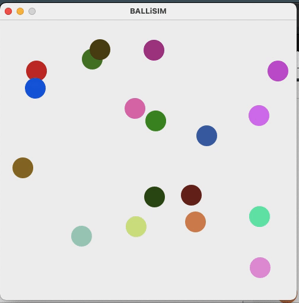

## SimBall

- To run 
	* Clone this repository.
	* Run this
		```bash
		java -jar simBall.jar
		```

- Compiling jar file from source.
	```bash
	echo "Main-Class: src/main/Main" > manifest.txt
	jar cvmf manifest.txt simBalljar ./src/main/*.class ./src/render/*.class
	```
</br>  

