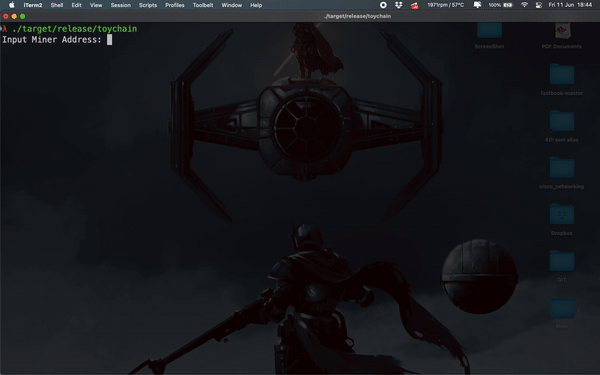

## BlockChain-toy

* Run it using `cargo run --release`
* Then `./target/release/toychain` 
* Check count of transaction and transaction made.
* Mine to block for transaction to appear.
* Match hash of previous block. (pre_hash)
* Change difficulty. (It takes more time when difficulty is set to 3, atleast on my system)

